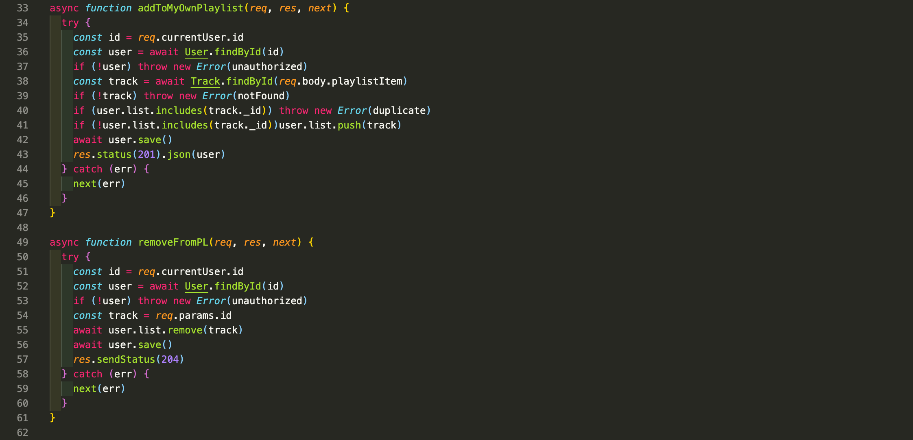
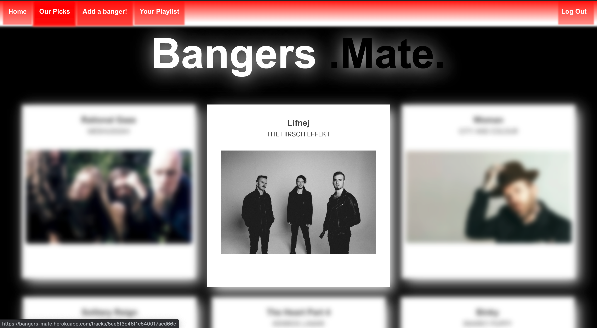
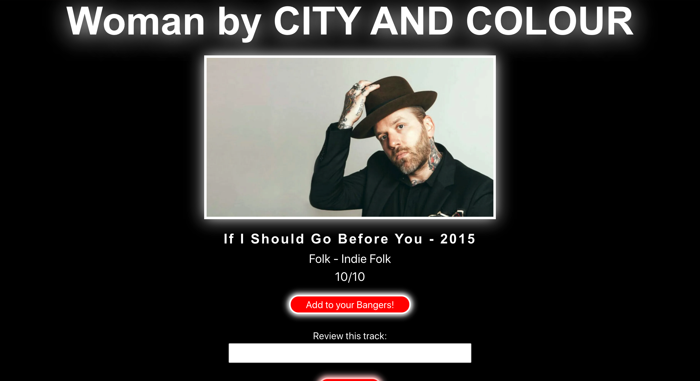
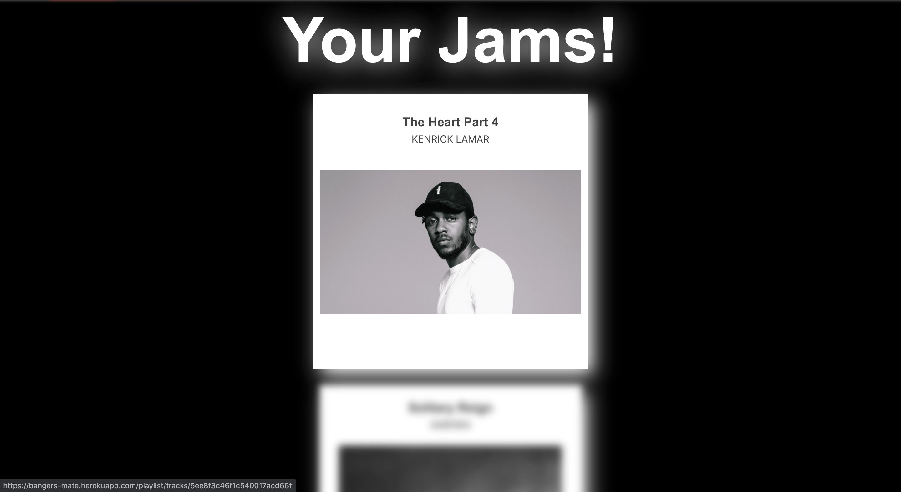

# Extra Project: Bangers.Mate.

## https://bangers-mate.herokuapp.com/

## **Overview**

This is an extra credit, full stack solo project that I created before the group project (SEI Project 3- https://github.com/EdwardGillard/sei-group-project). In this project I used **MongoDB, Express and Node.js** on the backend and **React** on the front end. I gave myself 8 days to complete this project in the evenings alongside my course and homework assignments. 

The app allows the user to add information about the songs they are currently listening to and add songs from the general list to a personal playlist.

------------------------------

## **Technologies used.**

### Backend: 

* **MongoDB**
* **Express**
* **Node.js**
* **Mongoose**
* JSON web token
* bcrypt
* body-parser
* mongoose-unique-validator

### Frontend:

* **React**
* **JSX**
* **SCSS**
* Axios
* Bulma
* http-proxy-middleware
* react-router-dom
* react-loader-spinner
* react-notify-toast

### Development tools:

* VS code
* Yarn
* Insomnia
* Git
* Github
* Google Chrome dev tools.
* Eslint
* Heroku

## **Approach**

### Backend.

This was my first experience in building a *full stack app*. Creating it offered me the opportunity to solidify my understanding of the *backend technologies* we had been learning in class. On the back end I used **MongoDB**, **Express** and **Node.js** to build a **RESTful API**.

This was also my first experience of deviating from what we had learnt in class to make customized controller functions. I did this by creating an *array* on the *user model* which took strings of ids then populated the whole track. To prevent the same song from being favourited twice, I used an *If statement* to create a conditional rejection of the post request if the array already contains the posted id. I then created a custom error response called *'duplicate'* to send a specific JSON response that I could then use on the frontend to tell the user that the track was already included in their playlist. I then created a remove from playlist function to give the user the ability to remove songs to keep their playlist up-to-date.

### Frontend.

As this was a personal project with the intention of strengthening my skills on the backend, I kept the front end relatively simple. I used **Axios** to send requests to the backend and handle basic *CRUD* functionality alongside the favourites feature mentioned above. 

I used the opportunity to play around with *SCSS* that I would not normally use in a project to create something a bit different to other projects in my portfolio. 

------------------------------

## **Screenshots of the Project.**

